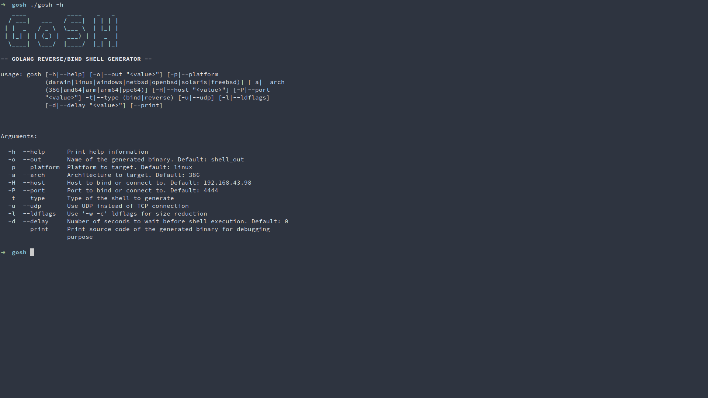

# GoSH
Golang reverse/bind shell generator

## Description
This tool generates a Go binary that launches a shell of the desired type on the targeted host.

The shell binary can be compiled for multiple platforms, supports partial polymorphism (unique functions' names) and can use UDP protocol instead of the default TCP. If you send a `DELETE` command over the established connection, the shell binary removes itself from the host it was executed on.

  
## License
This software is under [MIT License](https://en.wikipedia.org/wiki/MIT_License)
